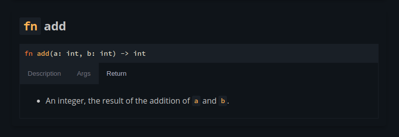

# rhai-autodocs

Generate Markdown documentation from a `rhai::Engine` instance.



## Features

- Output Rhai documentation as Markdown w/ HTML.
- Function ordering.
- Rust docs 'sections' format with default Markdown format or displayed using tabs.

## How to use

This library can be imported as a build dependency into your build script. A typical
documentation generation workflow would look like this:

```rust
// -- build.rs
fn main() {
    // Specify an environment variable that points to the directory
    // where the documentation will be generated.
    if let Ok(docs_path) = std::env::var("DOCS_DIR") {
        let mut engine = rhai::Engine::new();

        // register custom functions and types ...

        let docs = rhai_autodocs::options()
            .include_standard_packages(false)
            .generate(&engine)
            .expect("failed to generate documentation");

        // Write the documentation in a file, or output to stdout, etc.
    }
}
```

You need to import the `styles/default.css` file and `src/tabs.js` script for everything to work correctly. (You can of course override the styles and javascript code if you wish)
The generated markdown / HTML works best with [mdbook](https://rust-lang.github.io/mdBook/index.html). See the mdbook example for more details.
