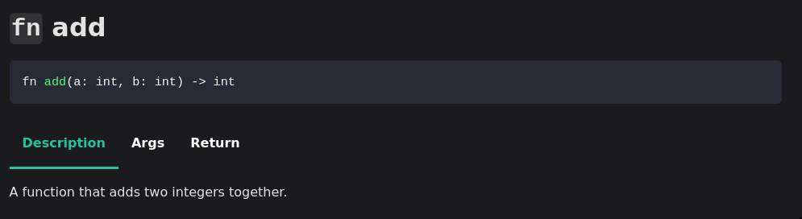

# rhai-autodocs

Generate Markdown/MDX documentation from a `rhai::Engine` instance.

Published with [Mdbook](https://rust-lang.github.io/mdBook/index.html).

Published with [Docusaurus](https://docusaurus.io/).


## Features

- Output native Rust Rhai function and custom types documentation as Markdown with HTML and Docusaurus with MDX.
- Function ordering using the `# rhai-autodocs:index:x` directive in your docs.
- Rust docs 'sections' (`# Section` in markdown) displayed with tabs.

## How to use

```rust
use rhai::exported_module;
use rhai::plugin::*;

// 1. Create a plugin module or any kind of Rhai API that supports documentation on functions and types.

/// My own module.
#[export_module]
mod my_module {
    use rhai::plugin::*;

    /// A function that prints to stdout.
    ///
    /// # Args
    ///
    /// * message - append a message to the greeting. (optional)
    ///
    /// # rhai-autodocs:index:1
    #[rhai_fn(global, name = "hello_world")]
    pub fn hello_world_message(message: &str) {
        println!("Hello, World! {message}");
    }

    // NOTE: since this function is an overload of "hello_world", the documentation can
    //       be written once on one of the functions, no need to write it multiple times.
    #[rhai_fn(global, name = "hello_world")]
    pub fn hello_world() {
        println!("Hello, World!");
    }

    /// A function that adds two integers together.
    ///
    /// # rhai-autodocs:index:2
    #[rhai_fn(global)]
    pub fn add(a: rhai::INT, b: rhai::INT) -> rhai::INT {
        a + b
    }

    /// Documentation for functions that do not have the index preprocessor
    /// is ignored.
    #[rhai_fn(global)]
    pub fn dont_care() {
        println!("nope");
    }
}

// 2. Generate the docs with autodocs. This library can be imported as a
//    build dependency into your build script.
//    A typical documentation generation workflow would look like this:

// Specify an environment variable that points to the directory
// where the documentation will be generated.
let docs_path = std::env::var("DOCS_DIR").unwrap_or("target/docs".to_string());

// Create a new engine and register all modules that need to have documentation generated
// for them. In this example, the module defined in the previous code block is registered
// into the engine, but you could register other functions and types ...
let mut engine = rhai::Engine::new();
engine.register_static_module("my_module", exported_module!(my_module).into());

/// Export the documentation as a [`ModuleDocumentation`]. You could stop here and generate
/// you own docs from this structure.
let docs = rhai_autodocs::export::options()
    .include_standard_packages(false)
    .export(&engine)
    .expect("failed to export documentation");

/// Or you could use pre-defined templates for docusaurus or mdbook.
/// Here, documentation is generated for docusaurus with some options.
let mdx = rhai_autodocs::generate::docusaurus()
    .with_slug("/docs/api")
    .generate(&docs)
    .expect("failed to generate mdx for docusaurus");

/// Iterate over the generated documentation for every modules.
for (name, docs) in mdx {
    // Write the documentation in a file, or output to stdout, or anything really.
    println!("docs for module {name}");
    println!("{docs}");
}
```

You need to import the `styles/default.css` file and `src/tabs.js` script for everything to work correctly using the [mdbook](https://rust-lang.github.io/mdBook/index.html) generation. (You can of course override the styles and javascript code if you wish)

For more details, see the examples.
